[toc]

## 一、项目概述

​        设计了一个基于树莓派和`Arduino`的智能实验室报警系统，可自动监控实验室的安全情况，当有异常情况发生时可立即发出**声光报警**信息，并且还开发了一个具备**人脸识别考勤**以及**监控多个实验室**等功能的图形界面软件，同时实现了**远程监控**（可公网访问）及**违禁品识别**等功能。全部实现的功能如下：
>①烟雾、温度检测；
②声光报警；
③人体检测；
④实验室无人时自动锁门；
⑤报警系统的解警；
⑥能记录实验室最近几天的安防情况；
⑦可在监控点监控多个实验室；
⑧远程监控；
⑨基于人脸识别的人员考勤功能；
⑩通过摄像头，结合视频分析是否有违禁物品进入实验室。
## 二、项目分析

> 总的设计思路用下图表示：
> 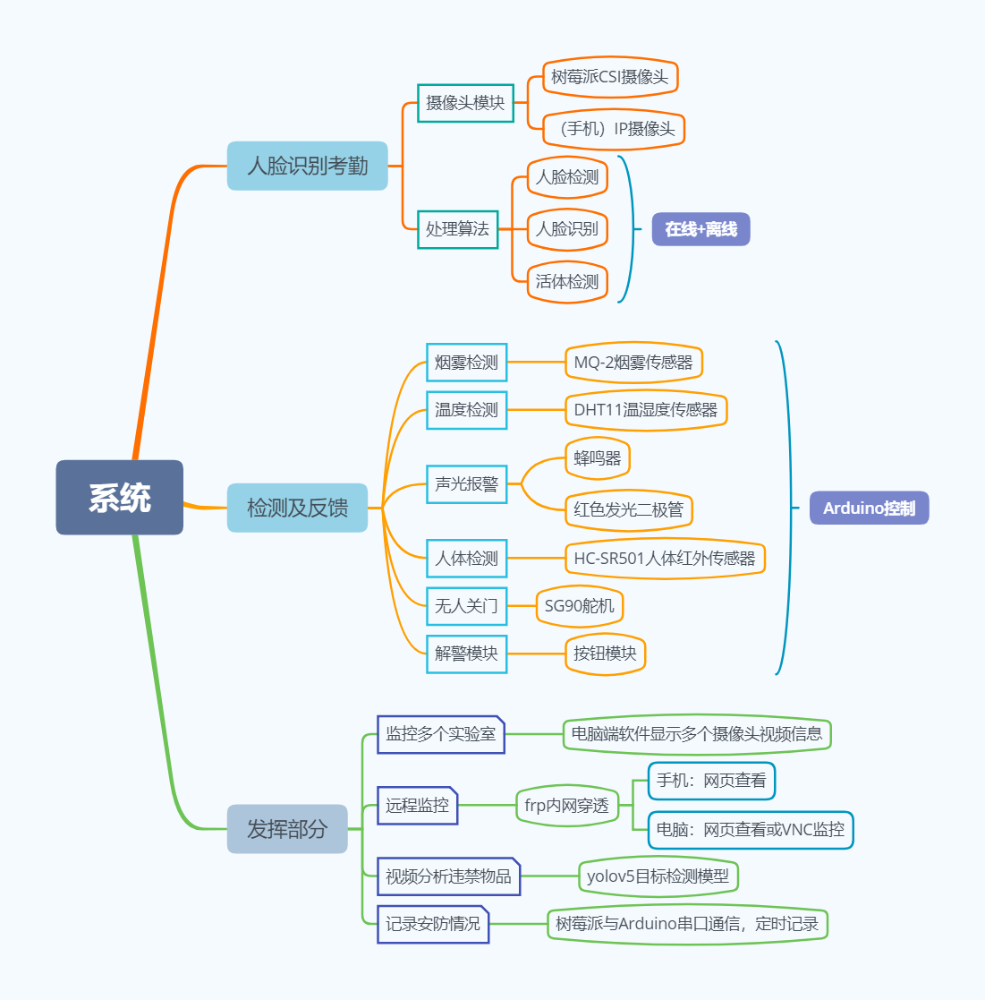

## 三、实现过程

### （一）传感器检测及反馈控制

（1）对于烟雾、温度、人体检测我们分别使用**MQ-2烟雾传感器、DHT11温湿度传感器、HC-SR501人体红外传感器**：

①MQ-2烟雾传感器是双路信号输出（模拟量输出及TTL电平输出），TTL输出有效信号为低电平，模拟量输出0~5V电压，浓度越高输出值越高，本项目中设定烟雾浓度模拟值的报警阈值为150；

②DHT11温湿度传感器以数字形式返回周围环境的温湿度，本项目中设定的温度报警阈值为24摄氏度；

③HC-SR501人体红外传感器在人进入其感应范围后输出高电平， 人离开感应范围后自动延时关闭高电平并输出低电平，本项目中选择的是**可重复触发**的模式。我们把检测到的高低电平信号作为判断实验室内是否有人的标准，若无人则控制SG-90舵机关门，实验室有人时门会打开。

<center class="half">
     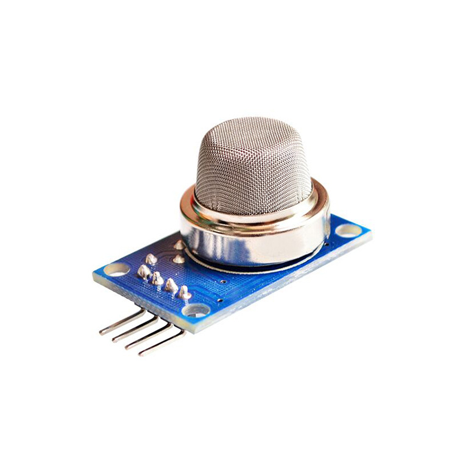
     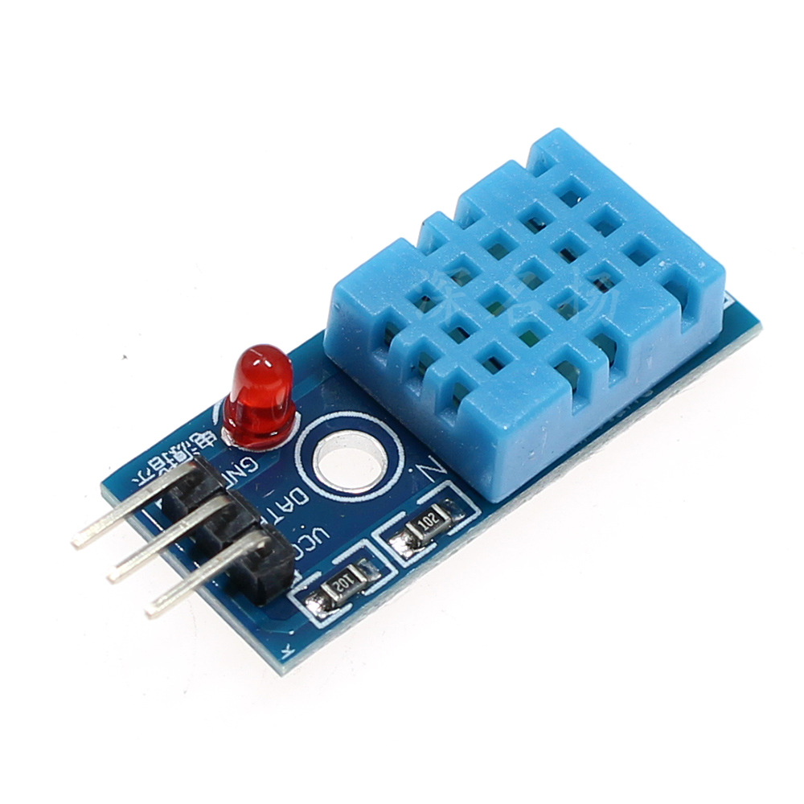
     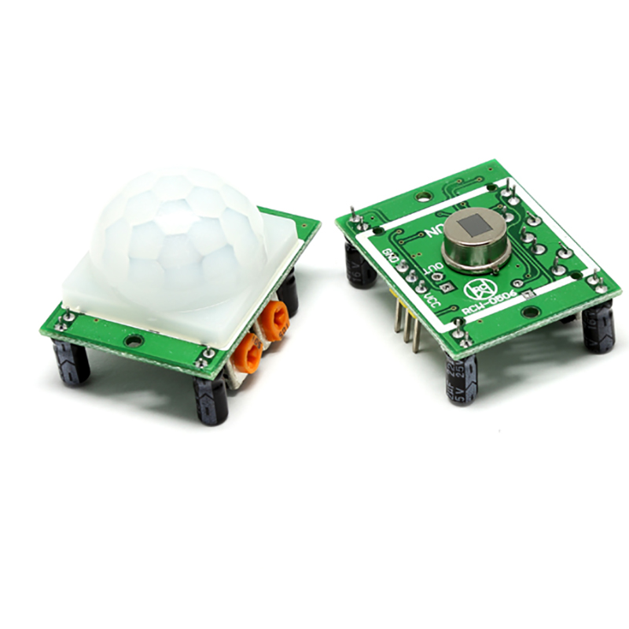
<br>
    <div style="color:orange; border-bottom: 1px solid #d9d9d9;
    display: inline-block;
    color: #999;
    padding: 2px;">
     MQ-2烟雾传感器、DHT11温湿度传感器、HC-SR501人体红外传感器
  	</div>
</center>

（2）对于声光报警，当检测到的烟雾浓度或温度大于设定的阈值后就会控制蜂鸣器响和发光二极管发红光从而实现声光报警；报警系统的解警功能通过一个按钮模块来实现，但本项目中我们**设定没有绝对的解警**，如果按下解警按钮（**至少长按1s**）后测量值仍然大于阈值（危险还在），虽然此时蜂鸣器不再响，但发光二极管会发出蓝光，并且延迟10后再次恢复声光报警状态，直至实验室温度和浓度都恢复正常。

<center class="half">
     
     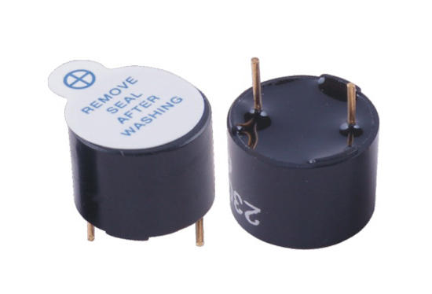
<br>
    <div style="color:orange; border-bottom: 1px solid #d9d9d9;
    display: inline-block;
    color: #999;
    padding: 2px;">
      SG90舵机、蜂鸣器
  	</div>
</center>
`其它说明：阈值设置较低方便演示；正常状态（温度和烟雾浓度都低于阈值）蜂鸣器不响，发光二极管发出绿光；这些传感器开启（通电）后需要等待5分钟初始化以越过不稳定状态，烟雾传感器发热正常，但烫手就不正常了；附加的LCD1602显示屏第一行显示温度、烟雾浓度模拟值，第二行显示实验室是否有人。`

### （二）人脸识别考勤

要想实现人脸识别考勤，我们主要考虑人脸检测、活体检测、人脸识别、记录考勤结果这几个功能。

（1）我们最先采用了`OpenCv`库（c++版本）自带的级联分类器来实现人脸检测及识别功能，发现精度较低，所以弃用；

（2）然后我们又采用了`OpenCv`库（c++版本）4.0版本后新加的`DNN`（深度神经网络）模块来实现人脸检测和调用了一个`facenet`模型进行欧氏距离计算实现了人脸识别功能，发现人脸检测效果很好，但人脸识别精度虽有提高却仍然不尽人意，所以弃用；

（3）随后我们转战python，调用了MTCNN的人脸检测模型和Insightface的人脸识别模型实现了人脸检测与人脸识别功能，发现这次检测和识别精度都还好，在pc端基本是实时的效果。然而，当我们把此程序移植到树莓派上后，发现速度是13秒1帧，速度非常低，根本达不到应用层面，所以在树莓派上弃用；

（4）可以发现上述检测及识别都是在离线状态下进行的，也没有考虑活体检测，所以基于需要**实时的应用效果**和树莓派较低的算力考虑，我们决定**调用百度云AI的人脸检测、人脸识别、活体检测功能**，并且也相应地采用Pyqt5库设计了一个电脑端的具有人脸识别考勤（包括活体检测）、视频监控多个实验室、记录考勤结果功能的图形界面**软件**，联网后运行在树莓派上可以达到实时效果，最终采用的是此方案。

`其它说明：由于我们我们只购买了一个树莓派CSI摄像头，并且此摄像头采集的画面并不是很清晰，所以推荐调用手机（安卓手机）IP摄像头画面。`

### （三）监控分析与记录

（1）对于监控多个实验室，我们队采用的方案是在设计的**电脑端软件画面中显示多个摄像头画面**，所以该软件兼具人脸识别考勤和整合摄像头采集到的多个实验室画面信息的功能。当然，又因为我们在树莓派上面设置了远程控制的功能，所以监控室里面的工作人员可以通过VNC软件控制监控树莓派运行的实时情况（还可在浏览器网页查看监控视频），也就是在监控点查看考勤情况和多个实验室的情况。

（2）对于远程监控，我们队结合阿里云服务器和树莓派通过`frp`**端口映射**实现了**内网穿透**的功能，所以在其它外网状态（非同一局域网）下有两种方法远程监控：

①在手机或电脑端**浏览器**地址栏输入树莓派的域名网址就可以查看实验室的实时监控视频；

②在电脑上通过**VNC软件**直接远程连接树莓派，达到电脑端远程监控和控制的功能。

（3)对于通过视频分析违禁品这一需求，我们队采用了**yolov5**的目标检测算法，**该算法需要在监控点的电脑设备上运行**，因为树莓派上面跑神经网络模型非常慢。目前我们在网上爬取了1000张小刀图片，整理标注后剩下600张，然后据此迭代400次训练了小刀这一类违禁品，调用训练好的模型后发现检测效果不错，不过遇到比较小的违禁品目标检测效果就欠缺了。

（4）对于记录最近几天的安防情况，我们通过树莓派和Arduino**串口通信**，每天都每隔一段时间将此段时间内的安防情况记录于*.txt文件中，包括最高最低温度、最高最低烟雾浓度、实验室是否有人、实验室是否关门等信息。

`其它说明：我们设想有专人在监控点看管，并且监控点有更好的电脑设备；只训练了小刀检测模型是因为笔者电脑配置不高，并且整理标注训练用数据集和训练过程非常耗时。`

## 四、电路与程序设计

### （一）电子模块连接

​		由于本项目中的检测及反馈方面都是**模块化**设计的，并且所有检测到的信息都由**Arduino**单片机处理和发出反馈信息，各元件相互独立又通过Arduino互相联系，所以电路设计主要在于各传感器和其它电子元件与Arduino之间的连接，我们队通过使用面包板和杜邦线来实现各电子元件与Arduino单片机I/O口之间的互连，较为简便。传感器详细说明见附录2，电路连接实物图如下：

>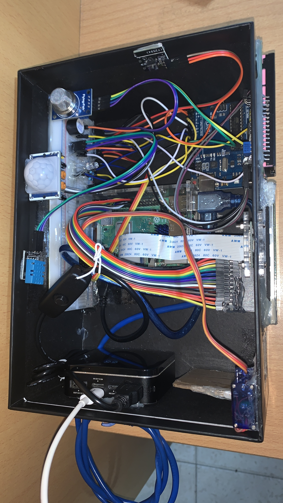

### （二）程序的设计

#### （a）Arduino控制方面

（1）已经提及本系统是模块化设计的，所以先定义相应的全局变量，然后各个功能都分别通过一系列函数来实现，例如烟雾检测用`smoke()`这个函数、关门用`closedoor()`这个函数等等；其中定义了`safevalue`这个变量来判断是否有危险，从而反馈相应的报警触发信息，<u>传感器检测这个线程</u>的代码设计逻辑流程图如下：

> 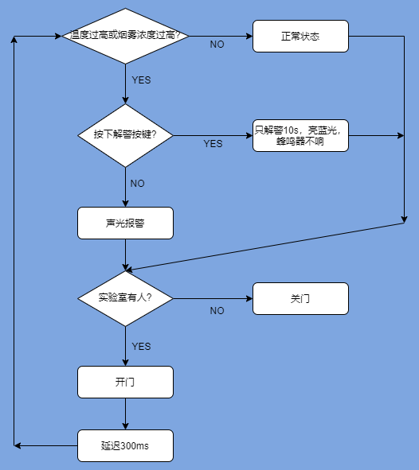

（2）对于树莓派与Arduino串口通信，树莓派方面用到了**serial-python**库；Arduino方面用到了**SCoop.h**库（多线程），并且还写了`rasp_arduino()`这个函数（在另外一个线程上运行），然后树莓派与Arduino通过USB连接串口通信，从而实现定时记录安防信息。


#### （b）人脸识别考勤及监控软件方面

（1）软件UI设计及运行方面，我们运用`Qtdesigner`二次开发设计了3个图形界面：

①主界面，包括签到窗口、多个实验室监控窗口；

②签到（人脸识别）情况反馈信息窗口；

②导出考勤结果界面。

（2）本软件中人脸识别考勤采用的是调用**百度云AI**的<u>人脸检测、人脸识别、活体检测</u>功能，具体参考百度智能云的API文档，当摄像头捕获到画面后以特定编码格式将图片发送至百度服务器，而后其又将检测结果以字典类型传输回来，然后我们据此判断即可；<u>检测结果还包括了性别、是否戴口罩等信息</u>；签到结束后可导出考勤结果。

#### （c）远程监控方面

​		对于远程监控，我们队申请了一台阿里云服务器，通过**frp**端口映射技术实现了内网穿透，结合**MJPEG-Streamer**服务实现网络视频流，所以在外网状态下可以远程控制树莓派。

#### （d）违禁品检测方面

​		我们队使用`github`上的开源目标检测算法**yolov5**来通过视频画面检测违禁品，<u>自己训练了一个检测小刀这类违禁品的模型</u>，演示如下：

（1）训练结果图：

>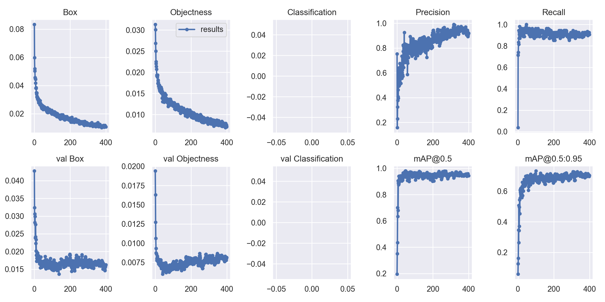
>
><center class="half">
>    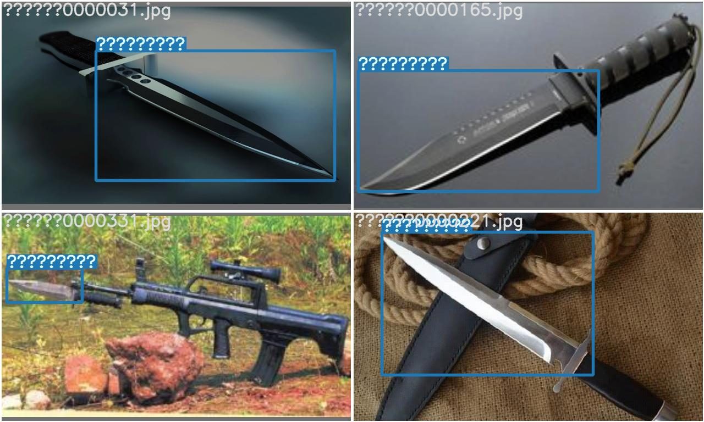
>    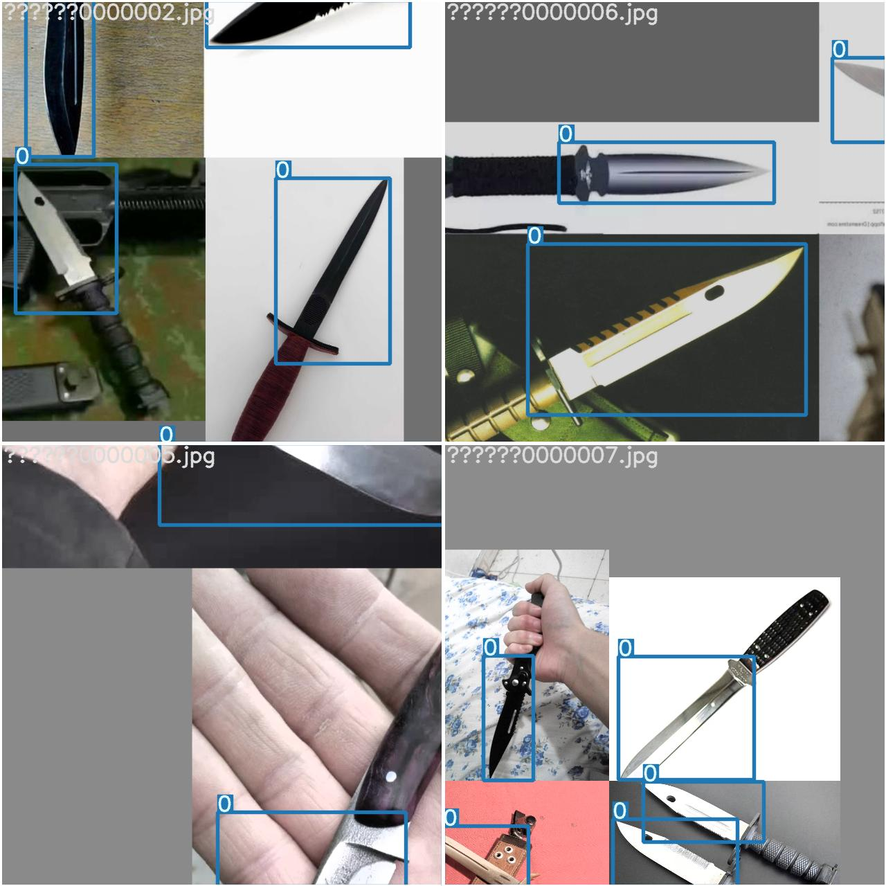
>     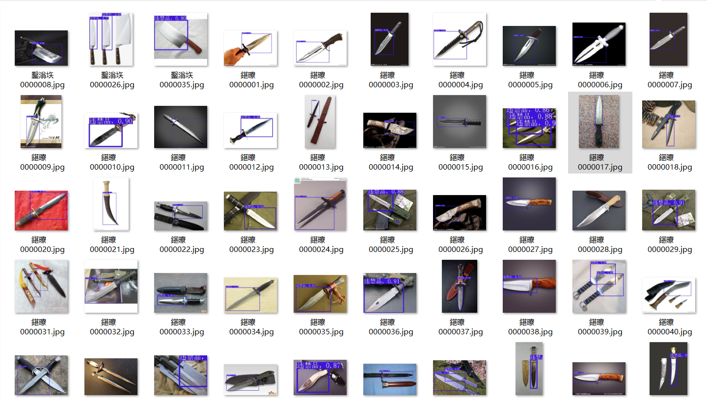
></center>         

（2）验证训练好的模型：

><center class="half">
>    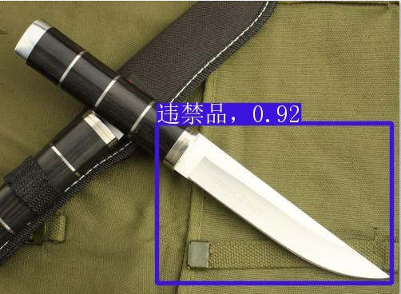
>    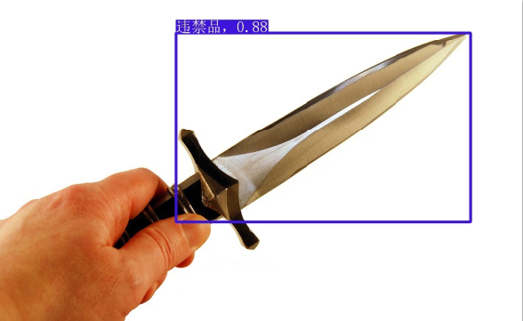
>     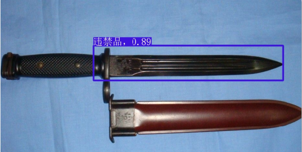
>     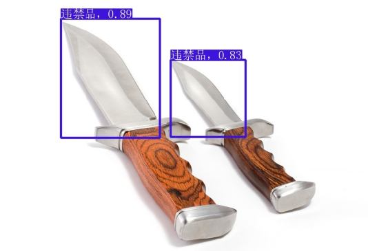
></center>                                                    

> ​		从以上检测图片可以发现检测“小刀”的效果还是不错的，但在我们队进一步实际测试时发现训练好的小刀检测模型在检测更小的违禁品目标时精度就下降了，并且如果摄像头像素不高画面不清晰的情况下误检率也上升了。

## 五、测试方案与测试结果

### （一）测试记录安防情况程序

​		将树莓派与Arduino连接后，运行程序后效果如下（安防情况被保存在桌面的`安防情况`文件夹里），符合预期情况。

<center class="half">    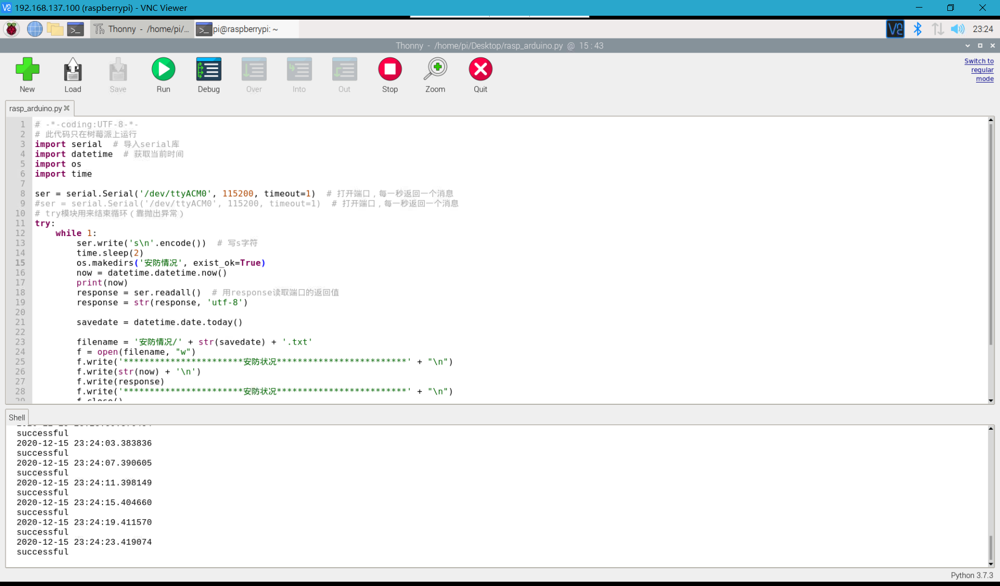    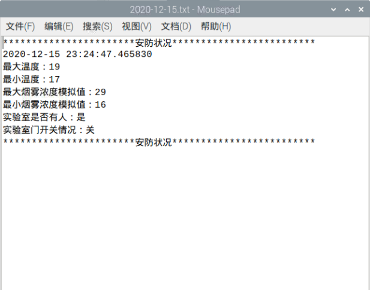    </center>          

### （二）测试违禁品识别程序

​		测试训练好的小刀检测模型效果如下图所示，可以发现笔者检测了6副违禁品画面，其中有5副测试成功，并且还可以发现这几张图片中的违禁品目标的大小还算是相对中等偏大，运用到其它场面时还<u>偶尔存在误检</u>，只能说效果勉强可以。

## 六、参考内容

> ①北京理工大学嵩天python教程：https://www.icourse163.org/learn/BIT-268001?tid=1460270441
>
> ②yolov5：https://github.com/ultralytics/yolov5
>
> ③百度智能云API文档：https://cloud.baidu.com/doc/FACE/s/yk37c1u4t
>
> ④树莓派远程监控：https://blog.csdn.net/qq_41923091/article/details/103962704
>
> ⑤yolov5训练自己数据集：https://blog.csdn.net/ojiwuxuan/article/details/107558286?biz_id=102&utm_term=yolo5%E8%AE%AD%E7%BB%83%E8%87%AA%E5%B7%B1%E6%95%B0%E6%8D%AE%E9%9B%86&utm_medium=distribute.pc_search_result.none-task-blog-2~blog~sobaiduweb~default-6-107558286&spm=1018.2118.3001.4450
>
> ⑥配置`frp`服务：https://blog.csdn.net/cao0507/article/details/82758288
>
> ⑦Pyqt5库教程：https://zhuanlan.zhihu.com/p/75561049

## 附录1：记录安防情况程序的开启

​		成功使树莓派联网，通过VNC远程桌面控制树莓派后，<u>点击树莓派桌面左上角打开命令行窗口</u>，输入以下命令：

```python
python /home/pi/Desktop/rasp_arduino.py
```

> 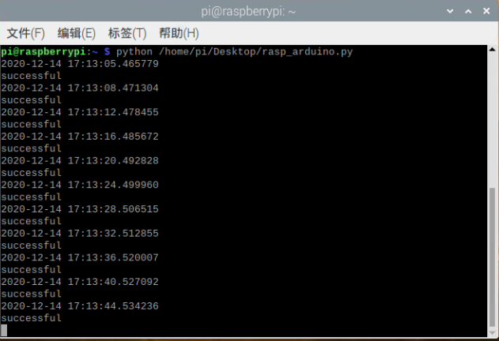
>
> 记录安防情况期间保存此命令行窗口开启，可在树莓派桌面的`安防情况`文件夹里面查看安防记录

> 若端口报错，则在树莓派命令行输入`ls /dev/tty*`，查看相应的设备号，如：
>
> 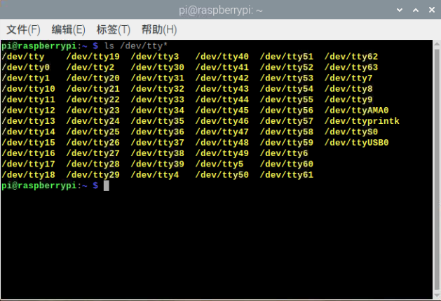
>
> 然后将下方代码中的`ttyACM0`改为相应的端口编号，例如上图中的为`ttyUSB0`。
>
> ```python
> ser = serial.Serial('/dev/ttyACM0', 115200, timeout=1)  # 打开端口
> ```
## 附录2：串口通信代码

### （1）树莓派端
```python
# -*-coding:UTF-8-*-
# 此代码只在树莓派上运行
import serial  # 导入serial库
import datetime  # 获取当前时间
import os
import time
ser = serial.Serial('/dev/ttyACM0', 115200, timeout=1)  # 打开端口，每一秒返回一个消息
# try模块用来结束循环（靠抛出异常）
try:
    while 1:
        ser.write('s\n'.encode())  # 写s字符
        time.sleep(2)
        os.makedirs('安防情况', exist_ok=True)
        now = datetime.datetime.now()
        print(now)
        response = ser.readall()  # 用response读取端口的返回值
        response = str(response, 'utf-8')
        savedate = datetime.date.today()
        filename = '安防情况/' + str(savedate) + '.txt'
        f = open(filename, "w")
        f.write('***********************安防状况*************************' + "\n")
        f.write(str(now) + '\n')
        f.write(response)
        f.write('***********************安防状况*************************' + "\n")
        f.close()
        print('successful')
except:
    #ser.close()  # 抛出异常后关闭端口
    print("error!!!")
```
### （2）Arduino端
```c++
void rasp_arduino()
{
    if (Serial.available()) //判断串口缓存区有没有数据
    {
        if ('s' == Serial.read()) //有数据就用read来读取并判断是不是s
        {
            Serial.print("最大温度：");
            Serial.println(Tep_max);
            Serial.print("最小温度：");
            Serial.println(Tep_min);
            Serial.print("最大烟雾浓度模拟值：");
            Serial.println(Smk_max);
            Serial.print("最小烟雾浓度模拟值：");
            Serial.println(Smk_min);
            Serial.print("实验室是否有人：");
            Serial.println(people);
            Serial.print("实验室门开关情况：");
            Serial.println(door);
        } //是的话就向串口打印这串字符
    }
}
```
## 附录3：传感器方面代码

```c++
#include "dht11.h"
#include <Wire.h>
#include "LiquidCrystal_I2C.h"
#include <Servo.h>
#include "SCoop.h"
#define temperature_threshold 24
#define smoke_threshold 200
Servo myservo; // 定义舵机对象
int pos = 0;   // 定义舵机转动位置
dht11 DHT11;
// set the LCD address to 0x27 for a 16 chars and 2 line display
LiquidCrystal_I2C lcd(0x27, 16, 2); 

defineTask(TaskTest);//完整定义

void setColor(int red, int green, int blue)
void smoke()
void LCD0(int j)
void LCD1()
void LCD2()
void judge()
void opendoor()
void closedoor()
int findmax(int m, int n)
int findmin(int m, int n)
void rasp_arduino()
    
void TaskTest::setup()
void TaskTest::loop()
    
defineTaskLoop(TaskTest1)//快速定义
    
void setup()
void loop()
```

> 以上并非完整代码，只是主要函数的定义，代码详见`mgmt.ino`。

---

end！